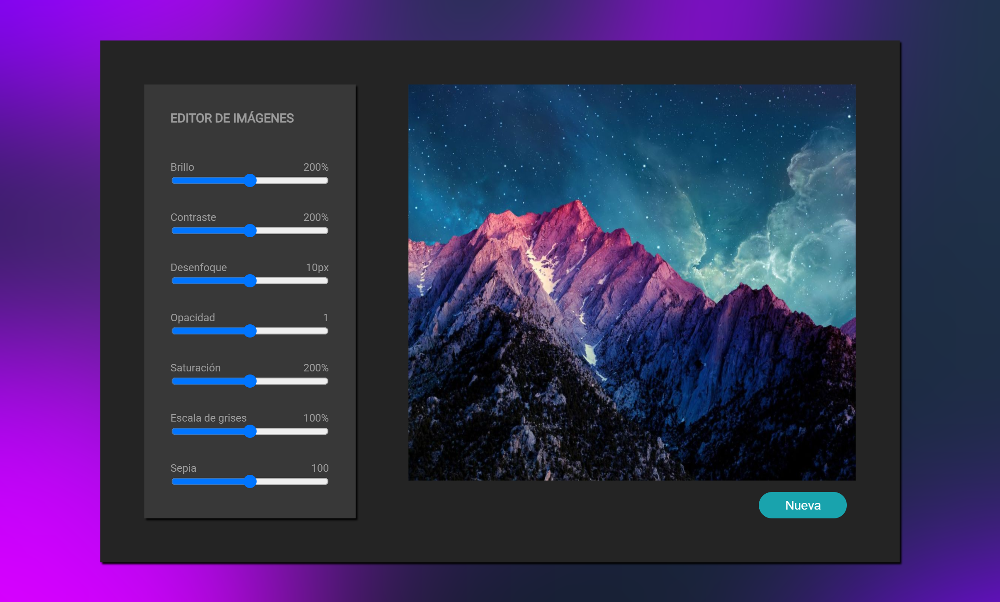

# Editor_imágenes

#### Este es un editor de imágenes, con el cual se modifica el brillo, contraste, escala de grises, sepia, etc.

#### Las imágenes a elegir pertenecen a una api local. Para activar el servidor de imágenes: 
###### npm install json-server -g 
###### json-server db.json

#### Para iniciar el proyecto:
###### npm run start
